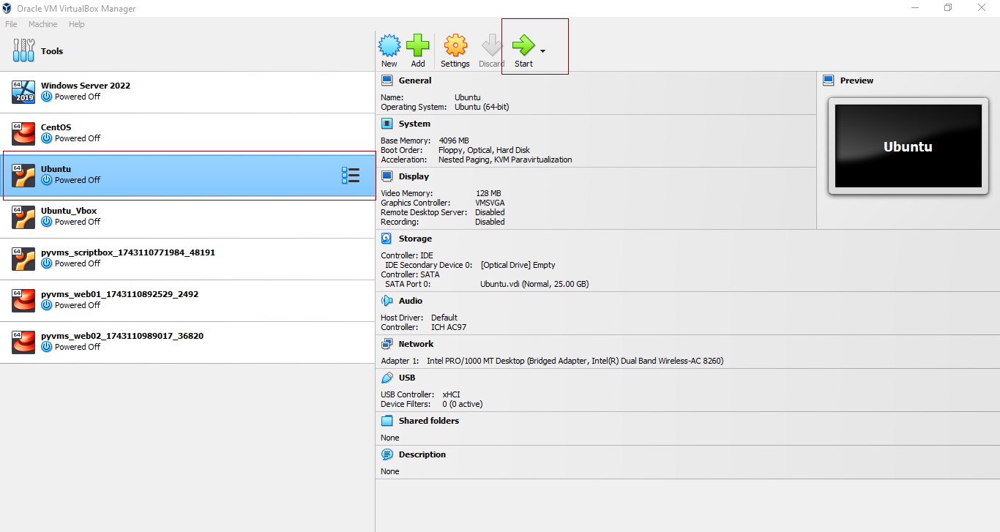
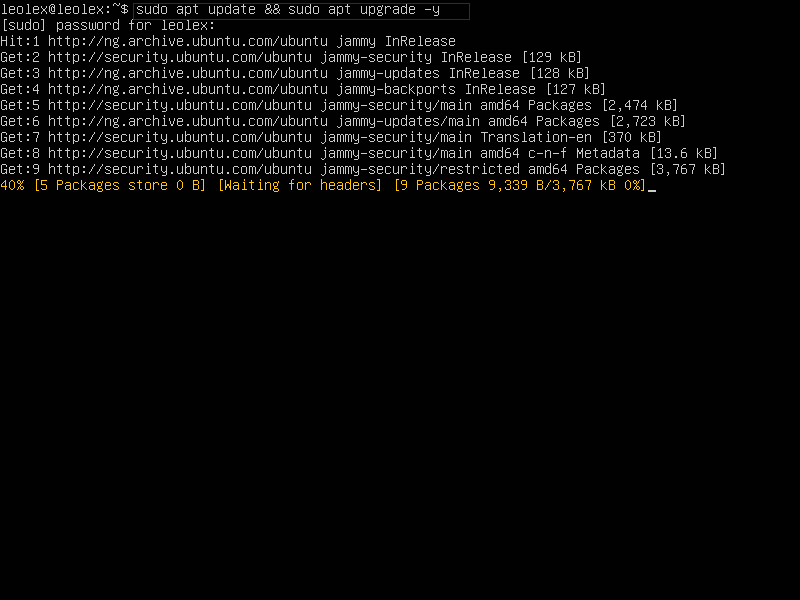
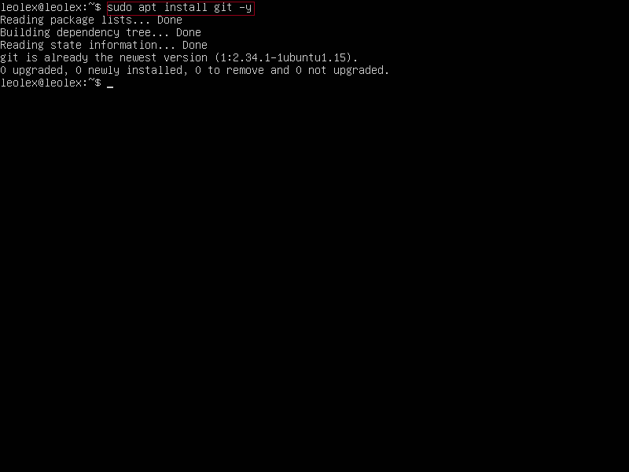
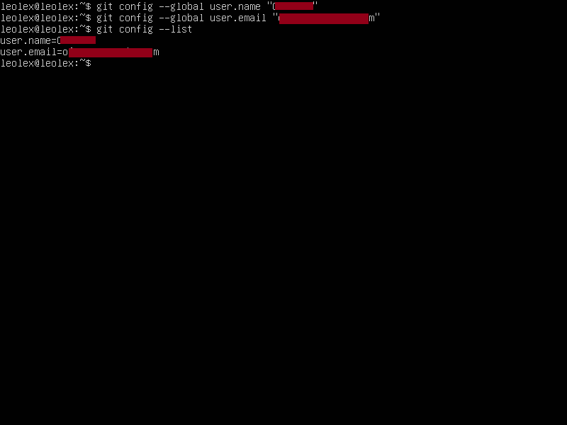
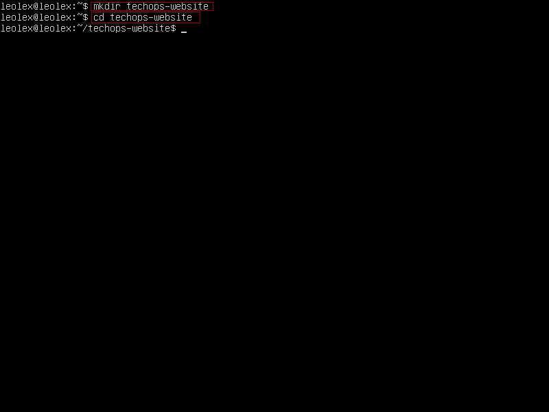
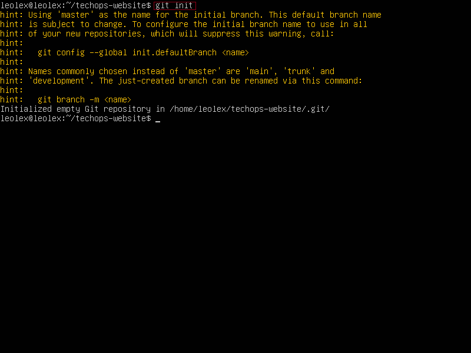
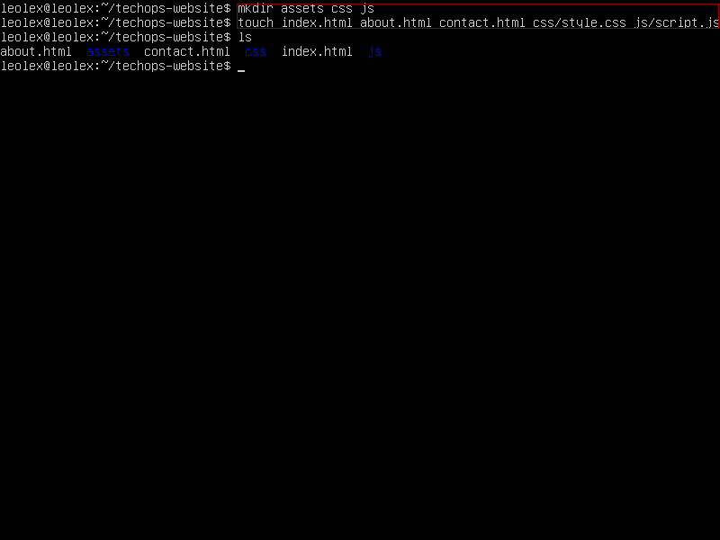
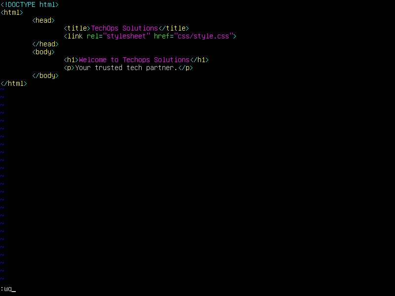
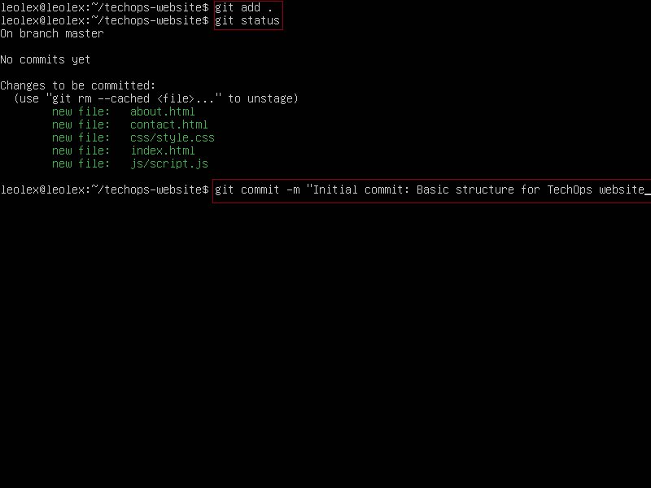

# E-Commace Platform Deployment with Git, linux, and AWS for TechOps

Step-by-step guide to developing and deploying a static website for “TechOps Solutions”, complete with Git version control, development on a Linux environment, and deployment on an AWS EC2 instance:

## Part 1: Environment Setup
### 1. Set Up Your Linux Environment (Ubuntu/Debian preferred)
#
```bash
sudo apt update && sudo apt upgrade -y
sudo apt install git nginx -y
```





#
### 2. **Install Git**

```bash
sudo apt install git -y
```


#
### 3. **Set Up Git Configuration**

```bash
git config --global user.name "Your Name"
git config --global user.email "you@example.com"
```


#
## Part 2: Project Initialization
### 4. Create a Project Folder

```bash
mkdir techops-website && cd techops-website
```


#
### 5. Initialize Git Repository

```bash
git init
```


#
### 6. Create Basic File Structure

```bash
mkdir assets css js
touch index.html about.html contact.html css/style.css js/script.js
```


### 7. Add Initial Content to HTML Files

#### `index.html`

```html
<!DOCTYPE html>
<html>
<head>
  <title>TechOps Solutions</title>
  <link rel="stylesheet" href="css/style.css">
</head>
<body>
  <h1>Welcome to TechOps Solutions</h1>
  <p>Your trusted tech partner.</p>
</body>
</html>
```

Repeat similar steps for `about.html` and `contact.html`.


#
## Part 3: Git Version Control

### 8. Stage and Commit Files

```bash
git add .
git commit -m "Initial commit: Basic structure for TechOps website"
```


## Part 4: AWS EC2 Deployment

### 9. Launch EC2 Instance

* Go to AWS Console
* Launch an Ubuntu EC2 instance
* Choose security group with **HTTP (port 80)** and **SSH (port 22)** open
* Download `.pem` key and set permissions:
```bash
chmod 400 your-key.pem
```

### 10. SSH into EC2 Instance

```bash
ssh -i "my-ubuntu-key.pem" ubuntu@ec2-13-49-74-210.eu-north-1.compute.amazonaws.com
```

### 11. Install Nginx and Git on EC2

```bash
sudo apt update
sudo apt install nginx git -y
```

## Part 5: Deploy Website to EC2

### 12. Clone Repo to EC2

```bash
git clone https://github.com/Ofrelex/techops-website.git
```

### 13. Move Website Files to Nginx Root
```bash
sudo cp -r techops-website/* /var/www/html/
```

### 14. Set Permissions (if needed)

```bash
sudo chown -R www-data:www-data /var/www/html
```

### 15. Restart Nginx

```bash
sudo systemctl restart nginx
```
## Part 6: Verification

### 16. **Access Website**

* Open a browser
* Visit: `http://13-49-74-210`

